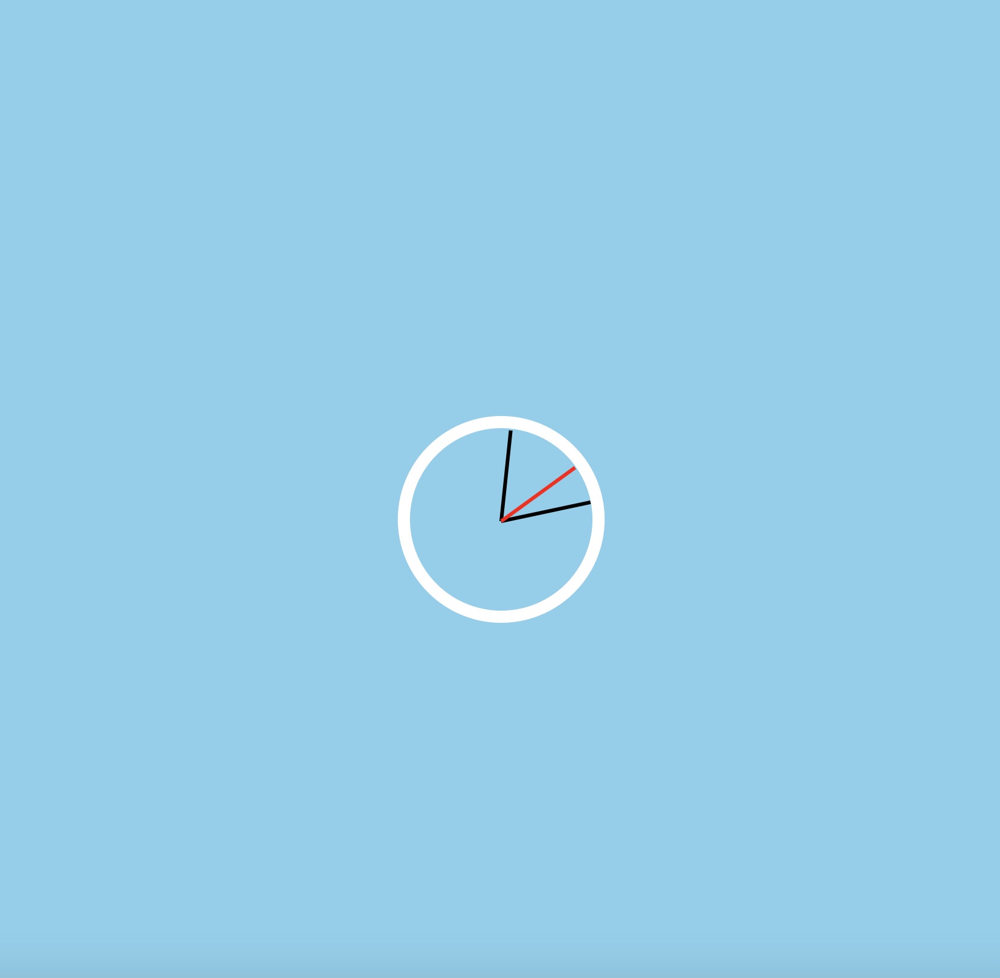

# Clock

- 과제 설명
  - Clock 프로그램을 웹에서 동작하도록 구현한다.
  - 초기 로딩 시 시계의 초침, 분침, 시침이 현재 시간을 가르킨다.

- 제한 사항
  - Chrome 64 버전 이상에서 동작해야 한다.
  - DOCTYPE은 html5를 사용하며 ES6+로 개발한다. 
  - npm install, npm start로 테스트 가능하도록 구성한다. 
  - 모든 라이브러리와 프레임워크는 사용할 수 없다.
  - 디자인 요소는 채점하지 않는다.

- 화면 예시
  

